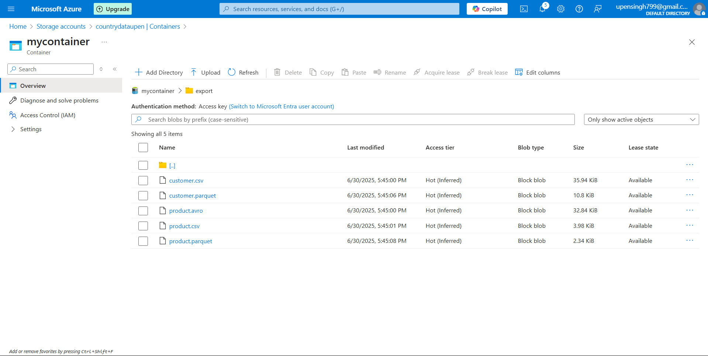
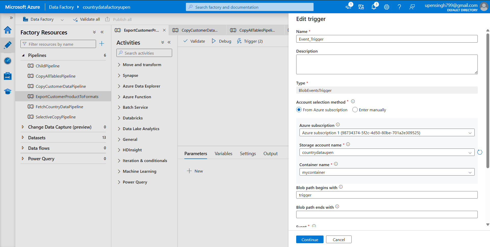
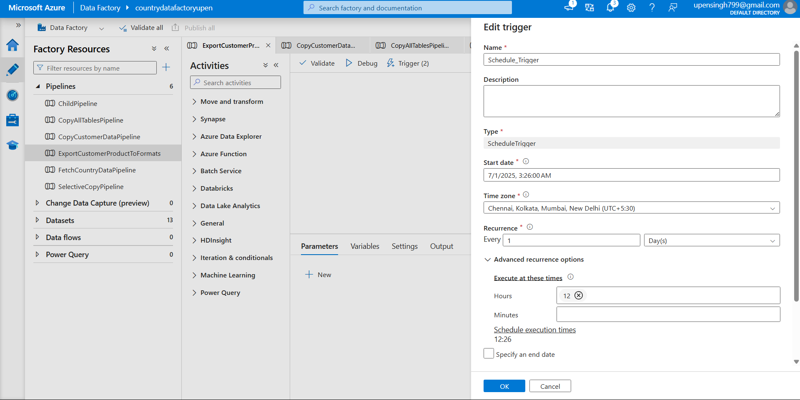
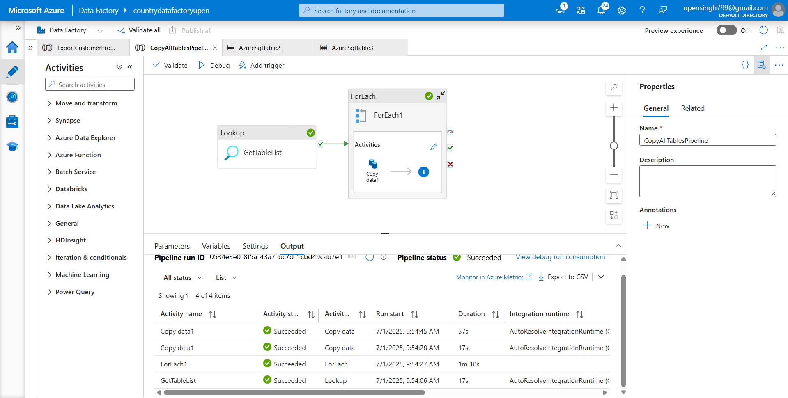
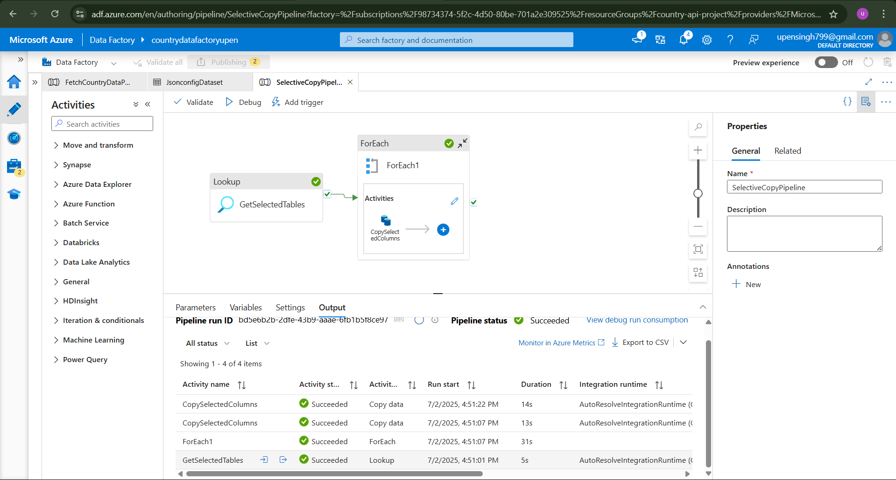
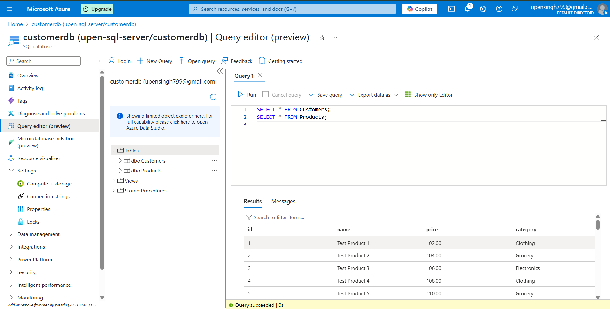

# 🚀 WEEK 5 ASSIGNMENT : AZURE ADF PIPELINE -

This project demonstrates four practical data integration tasks using **Azure Data Factory**. Each task includes detailed pipeline design, screenshots, triggers, and explanations.

---

## ✅ Task 1: Export SQL Data to CSV, Parquet, and Avro

### 🔍 Objective

Export data from SQL tables (`Customers`, `Products`) to three formats: CSV, Parquet, and Avro.

### 🧱 Pipeline Overview

* 6 Copy activities:

  * 3 for `Customers`: CSV, Parquet, Avro
  * 3 for `Products`: CSV, Parquet, Avro
* Sink: Azure Blob Storage

### 📸 Screenshots

### Pipeline :

###  Pipeline JSON :

📄 [Full Pipeline.json](ADF-Assignment/ExportCustomerProductToFormats.json)

---

### Output : 

---

## ✅ Task 2: Configure Schedule and Event Triggers

### 🔍 Objective

Automate the pipeline from Task 1 using:

* A **Schedule Trigger** (runs daily at 9 AM IST)
* An **Event Trigger** (fires when `.txt` files are uploaded to Blob)

### ⚙️ Trigger Setup

* **Schedule Trigger:** `DailyExportTrigger`
* **Event Trigger:** `BlobEventTrigger` (Event Grid based)

### 📸 Screenshots

### Event Triggers :

---

### Schedule Trigger : 

---
## ✅ Task 3: Copy All Tables from One Database to Another

### 🔍 Objective

Replicate all base tables from `customerdb` to `customerdb_copy`.

### ⚙️ Key Components

* Lookup: Gets list of all base tables
* ForEach: Iterates over tables
* Copy Activity: Dynamically uses table names
* Parameters: Used in source and sink datasets

### 📸 Screenshots

### Pipeline :

---

### Pipeline Json:

[Full Pipeline.json](ADF-assignment/CopyAllTables_Pipeline.json)

---

### Output :

(Screenshots)

---
## ✅ Task 4: Selective Copy (Specific Tables and Columns)

### 🔍 Objective

Use a JSON config file to copy **specific tables and columns** only (e.g., `Customers` with only `CustomerID`, `Name`, etc.)

### ⚙️ How It Works

* `config.json` stored in Blob
* Dataset reads JSON config
* ForEach iterates through config rows
* SQL query is dynamically built with SELECT column list

### 📸 Screenshots

### Pipeline: 

---

### Pipeline JSON:

[Full Pipeline.json](ADF-assignmentSelectiveCopy_Pipeline.json)

---

### Output : 

---

## 🔚 Final Note

> Every pipeline includes:

* JSON definition
* Screenshots
* Clear explanation
* Use of ADF best practices like parameterization, triggers, modular pipelines.

📌 **This project demonstrates real-world skills in Azure Data Factory.**
