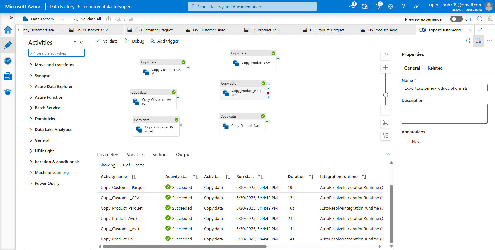

# 🚀 Azure Data Factory Assignment – CSI Internship 2025

This project demonstrates four practical data integration tasks using **Azure Data Factory**. Each task includes detailed pipeline design, screenshots, triggers, and explanations.

---

## ✅ Task 1: Export SQL Data to CSV, Parquet, and Avro

### 🔍 Objective

Export data from SQL tables (`Customers`, `Products`) to three formats: CSV, Parquet, and Avro.

### 🧱 Pipeline Overview

* 6 Copy activities:

  * 3 for `Customers`: CSV, Parquet, Avro
  * 3 for `Products`: CSV, Parquet, Avro
* Sink: Azure Blob Storage

### 📸 Screenshots

### Pipeline :



---

## ✅ Task 2: Configure Schedule and Event Triggers

### 🔍 Objective

Automate the pipeline from Task 1 using:

* A **Schedule Trigger** (runs daily at 9 AM IST)
* An **Event Trigger** (fires when `.txt` files are uploaded to Blob)

### ⚙️ Trigger Setup

* **Schedule Trigger:** `DailyExportTrigger`
* **Event Trigger:** `BlobEventTrigger` (Event Grid based)

### 📸 Screenshots

> *(Add these under `/screenshots/triggers/`)*

* `schedule_trigger.png` – Setup of daily trigger
* `event_trigger_register.png` – Event Grid registration view
* `trigger_pipeline_binding.png` – Pipeline linked to trigger
* `trigger_run_history.png` – Proof of trigger execution

---

## ✅ Task 3: Copy All Tables from One Database to Another

### 🔍 Objective

Replicate all base tables from `customerdb` to `customerdb_copy`.

### ⚙️ Key Components

* Lookup: Gets list of all base tables
* ForEach: Iterates over tables
* Copy Activity: Dynamically uses table names
* Parameters: Used in source and sink datasets

### 📸 Screenshots

> *(Add these under `/screenshots/full_db_copy/`)*

* `lookup_tables_activity.png` – `INFORMATION_SCHEMA.TABLES` lookup
* `foreach_loop_all_tables.png` – ForEach config
* `dynamic_datasets_all_tables.png` – Parameterized source/sink datasets
* `destination_db_verify.png` – Destination tables seen in SSMS or Query Editor

---

## ✅ Task 4: Selective Copy (Specific Tables and Columns)

### 🔍 Objective

Use a JSON config file to copy **specific tables and columns** only (e.g., `Customers` with only `CustomerID`, `Name`, etc.)

### ⚙️ How It Works

* `config.json` stored in Blob
* Dataset reads JSON config
* ForEach iterates through config rows
* SQL query is dynamically built with SELECT column list

### 📸 Screenshots

> *(Add these under `/screenshots/selective_copy/`)*

* `config_json_blob.png` – JSON file stored in Blob
* `json_dataset.png` – Dataset pointing to JSON file
* `pipeline_selective_copy.png` – Full pipeline showing dynamic query
* `destination_verify_selective.png` – Destination table preview

---

## 🧠 Optional: Additional ADF Components

> *(Useful if shown in your pipeline)*

### 📸 Screenshots

* `integration_runtime.png` – Auto or SHIR used
* `linked_services.png` – SQL + Blob linked services
* `monitor_pipeline_runs.png` – Pipeline execution history tab

---

## 📁 Folder Structure (Recommendation)

```bash
├── README.md
├── pipelines/
│   ├── ExportCustomerProductToFormats.json
│   ├── FullDBCopyPipeline.json
│   ├── SelectiveCopyPipeline.json
├── screenshots/
│   ├── export_formats/
│   ├── triggers/
│   ├── full_db_copy/
│   ├── selective_copy/
├── config/
│   └── config.json
```

---

## 🔚 Final Note

> Every pipeline includes:

* JSON definition
* Screenshots
* Clear explanation
* Use of ADF best practices like parameterization, triggers, modular pipelines.

📌 **This project demonstrates real-world skills in Azure Data Factory.**
